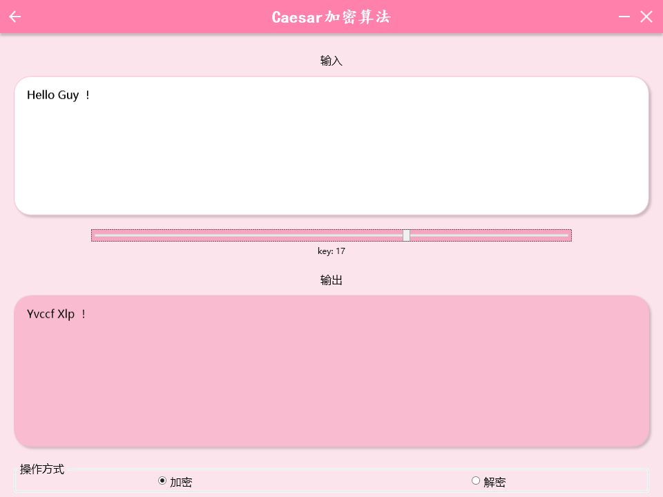
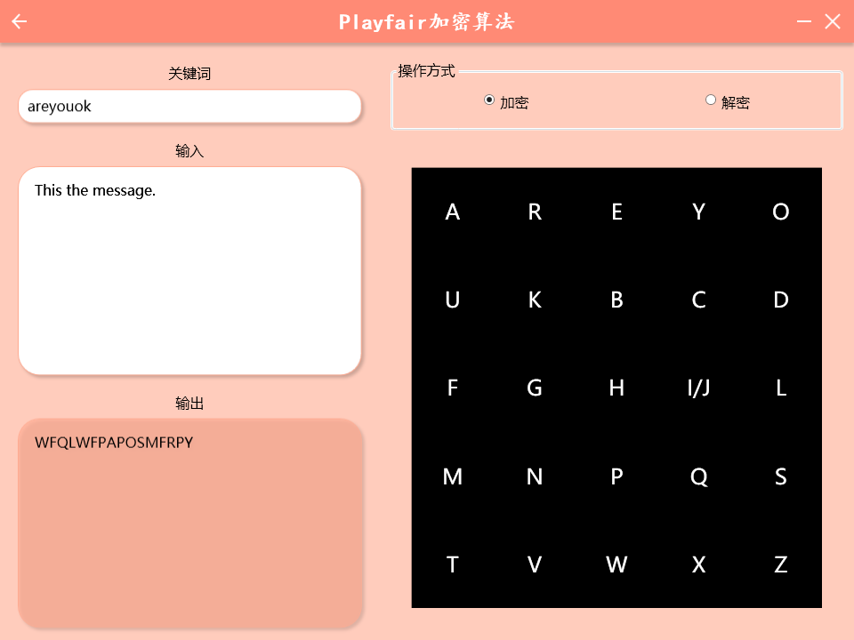
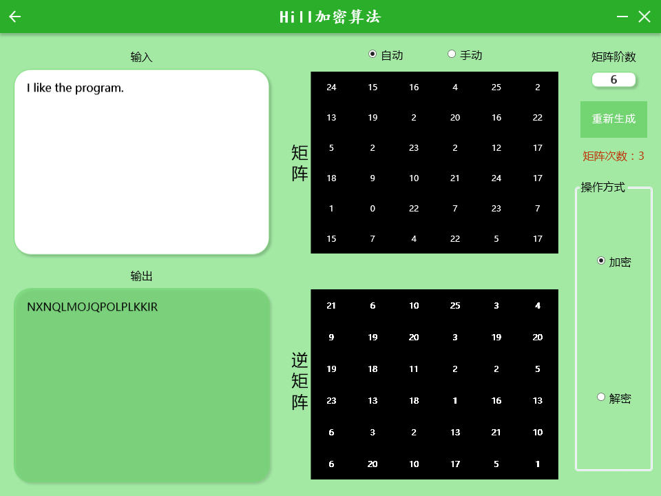
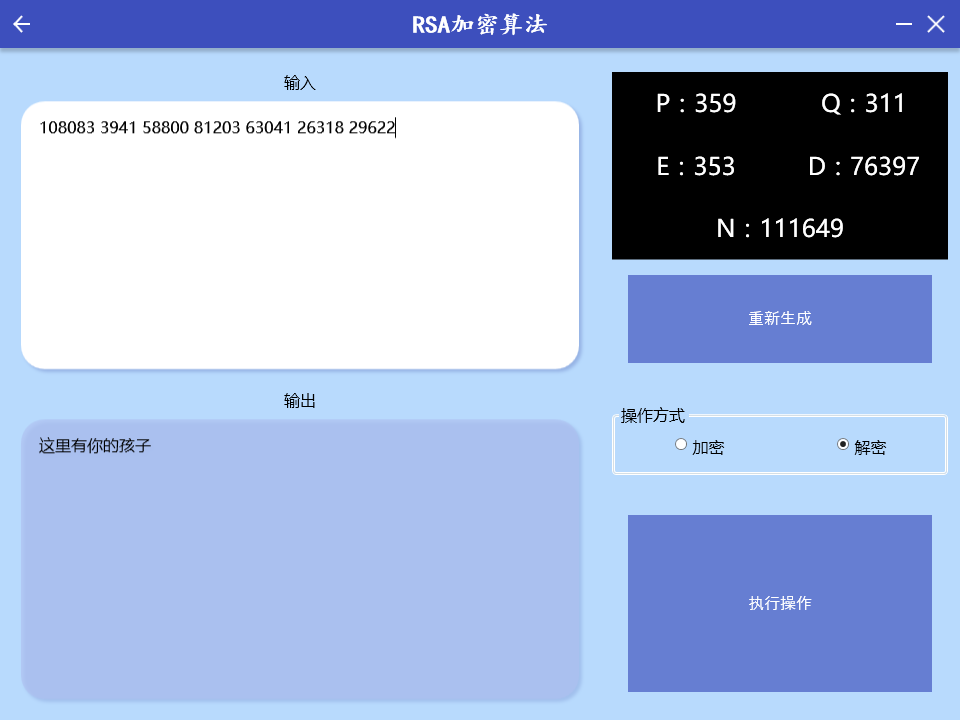

# 基于.net 4.0框架的Cipher演示程序

os：信息安全作业

## 实现算法

1. Caesar

2. Playfair

3. Hill

4. RSA

## 说明

1. 前3个程序采用“响应输入”的方式，即一旦有输入，立刻加密解密输出。RSA由于速度的限制，没有采用。

2. Hill算法使用了通用的n阶高斯消元解法，C#实现的代码可以在1秒内算出400阶以内矩阵的逆矩阵，但由于WPF控件的高阶生成消耗过多内存，图形界面限制在20阶左右。优化方法是一个TextBlock控件内放所有矩阵数据。

3. RSA算法采用大数运算，先预处理10e6以内的素数表，再随机抽取p与q和e。对每一个UTF-8字符先转换为大数运算后保存，解密对每一个大数运算转换回UTF-8字符。
